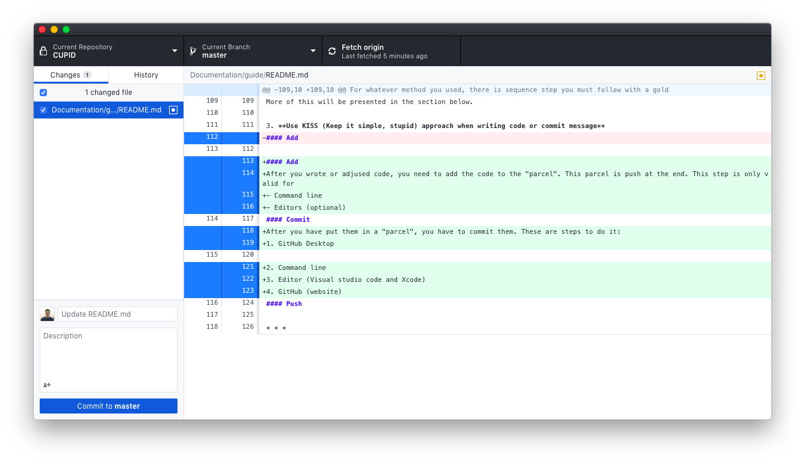

# How to start with CUPID
Written by [Hieu Le](https://github.com/hieulel)

**Table of Contents**
- [How to start with CUPID](#how-to-start-with-cupid)
  - [UNIX Environment](#unix-environment)
    - [Only remember these:](#only-remember-these)
      - [Go to a directory `cd` and list `ls`](#go-to-a-directory-cd-and-list-ls)
      - [Create `mkdir`, `touch`, remove `rm` and move `mv` file or directory](#create-mkdir-touch-remove-rm-and-move-mv-file-or-directory)
  - [Version control, Git](#version-control-git)
    - [How to start?](#how-to-start)
    - [The golden triangle](#the-golden-triangle)
      - [Add](#add)
      - [Commit](#commit)
      - [Push](#push)
  - [Structure of the CUPID Documentation](#structure-of-the-cupid-documentation)
    - [Subroutine](#subroutine)
    - [Outline code structure](#outline-code-structure)
      - [Layers](#layers)
      - [Time structure](#time-structure)

This document is made for beginners who do not experience in:
* UNIX environment
* Version control, Git
* The structure of the CUPID documentation

Here I show you how to initiate your knowledge on UNIX environment, version control and the structure of the source code.

## UNIX Environment
Unix environment is an operating system consisting of three important features; a kernel, the shell and a file system.

1. Window OS
Since Unix is not native on Window OS, I have installed on your computer equipped with Ubuntu and and UNIX command line (including `gfortran`)
2. Mac OS
It is built-in and I installed `gfortran` on Terminal already.

### Only remember these:
On your terminal (or Command Prompt, i.e. `cmd` on Window OS)

#### Go to a directory `cd` and list `ls`
```shell
cd CUPID #go to CUPID folder 
cd CUPID/src #go to CUPID folder, then folder src
cd .. #go back
ls #list the directory
ls -li #list the information of the directory with permission control
```
Visit this [Bash Permission control video](https://youtu.be/oxuRxtrO2Ag?t=3400) for more info.

#### Create `mkdir`, `touch`, remove `rm` and move `mv` file or directory
Remember, you can use these command for **multiple file and folders**
```shell
mkdir foldername #create folder with name
touch filename #create file with name
rm filename #delete file
rmdir foldername #remove EMPTY directory, 
rm -r foldername #remove directories with sub-directories with confirmation
rm -rf foldername #remove directories with sub-directories with no confirmation prompt
mv filename foldername #move file to a folder, this can be apply for folder as well.
```

## Version control, Git
Git is a distributed version-control systems to tracking changes in source code during software development. It is designed for coordinating work among programmer. Its goals include speed, data integrity, and support for distributed, non-linear workflows.

In respect of CUPID, code development will be divided into different sections for team members to work on. Different from a word processor document and spreadsheet, the code only makes sense and work when it is in a full package, i.e. line by line. Since members can work on the code separately, therefore compiling error is almost expected if Git is not implemented. In this document, I will explain how it works and how you can use it effectively. 

### How to start?
From aforementioned clarification, all of the package requires for code development has been installed in your computer, including Git.

There is several ways you can work with Git right away.
1. **Website**

Website allow you work with Git right away, by writing your code on editor, then go to Github website to upload your files (similar to any cloud service: Google Drive, Microsoft OneDrive, Dropbox, etc.). **Drawbacks** include the requirement of internet connection (of course), slow workflow (have to access the site, sign in, go to repos, upload, blah blah)

2. **GitHub Desktop**

For the beginner, I think this is the easiest way for you to start with. This include the software GitHub Desktop on your computer (I installed this for you already). 
Whenever you make changes to the code, it automatically detect and show on the interface, ready for commit. You can push to the internet with the command push in the app (with internet of course). **Drawback:** Switch between software quite often. 

Output on GitHub Desktop
```diff
+ This line is added
- This line is removed
```

3. **Editors (with built-in Git)**

This method depends on your chosen editor, these editors below supported built-in Git.
* MacOS: Xcode, Visual Studio Code, Atom
* WindowOS: Visual Studio Code, Atom

Similar to GitHub Desktop, it has buttons and click for GitHub commit while you write code.

4. **Command Line (bash)**

The last method require the most effort, however if you get it, it is lightning fast. Other methods for you are now too slow and ineffective.
The last method require you to use the terminal (MacOS and Linux) or Command Prompt (Window OS). This method can be built in when you are writing code, which make controlling version is so much faster. What you need for this: Terminal/Command Prompt and internet.

Use these command below to make version control great again:
* (Optional) Pull
```git
git pull
```
* (Required) Add
```git
git add filename #add file for commit folder
git add . #alternative way to add all
```
	
* (Required) Commit
```git
git commit -m "Your message here"
```
* (Required with internet) Push
```git
git push origin "master" #Push to master branch
git push --force-with-lease #when there is error, just you this command
```
### The golden triangle
For whatever method you used, there is sequence step you must follow with a golden rule when use version control.

1. **When you write or adjust code, don't just commit yet, please run on your computer see if it works first**
2. **If there exists an issue in the code or an issue was just published**, DON'T EDIT code in `origin/master` (`master` branch). **You must use** `git branch issue-number`.

*This means you edit the code in different branch, and it does  not impact on the main code*

More of this will be presented in the section below.

3. **Use KISS (Keep it simple, stupid) approach when writing code or commit message**

#### Add
After you wrote or adjusted code, you need to add the code to the "parcel". This parcel is push at the end. This step is only valid for
- Command line 
```git
git add filename
```
- Editors (optional)
#### Commit
After you have put them in a "parcel", you have to commit them. These are steps to do it:
1. GitHub Desktop
Refer to the left hand corner

2. Command line
```git
git commit -m "message"
```
3. Editor (Visual studio code and Xcode)
Use command `command+shift+p` (MacOs) or `ctrl+shift+p` (WindowOS) and select commit

4. GitHub (website)
Just click to "Upload files" then write your commit message

#### Push
The last stage was to push
- Editor: Open Command Pallet and `push`
- GitHub Desktop and Website: use feature push
- Command line: use aforementioned [steps](#how-to-start)
* * *

## Structure of the CUPID Documentation
The structure of cupid is discussed vastly in this document. This document focus on how the code works, and provide some tips and trick for CUPID.

### Subroutine
Please refer to [this link](../Documentation/subroutines/subroutine.md) for the subroutine structure and manual.
### Outline code structure 
#### Layers
CUPID divides its layers into four layers:
1. Layer above the canopy (upper boundary to canopy top)
2. Canopy layer (canopy top to canopy bottom)
3. Above ground layer (canopy bottom to soil surface)
4. Layer below the soil surface (soil surface to the lower boundary).

#### Time structure

