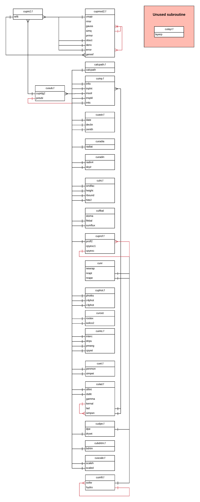

# CUPID Subroutine Structure

## Introduction
In Cupid, there exists many subroutines.This is a reason why we need to care how our code works. As a result, I wrote this Markdown file to show the detail of each subroutine including
1. Usage
2. Main structure
3. Algorithm (if available)
4. `CALL` function to interconnect with other subroutines
Nonetheless, please follow the Table of Contents (TOC) to access it as a library.

## Table of Contents
1. [`calcpath.f`](###`calcpath.f`)
2. [`cuastr.f`](###`cuastr.f`)

## Subfile
<!-- For each heading, add usage, structure and subroutine called -->
### `calcpath.f`
#### Usage
#### Main Structure
#### Other subroutine `CALL` function

### `cuastr.f`
#### Usage
#### Main Structure
#### Other subroutine `CALL` function

### `cubdrtm.f`
#### Usage
#### Main Structure
#### Other subroutine `CALL` function

### `cudpe.f`
#### Usage
#### Main Structure
#### Other subroutine `CALL` function

### `cuet.f`
#### Usage
#### Main Structure
#### Other subroutine `CALL` function

### `cuht.f`
#### Usage
#### Main Structure
#### Other subroutine `CALL` function

### `cuinf.f`
#### Usage
#### Main Structure
#### Other subroutine `CALL` function

### `cuinp.f`
#### Usage
#### Main Structure
#### Other subroutine `CALL` function

### `cuintc.f`
#### Usage
#### Main Structure
#### Other subroutine `CALL` function

### `culad.f`
#### Usage
#### Main Structure
#### Other subroutine `CALL` function